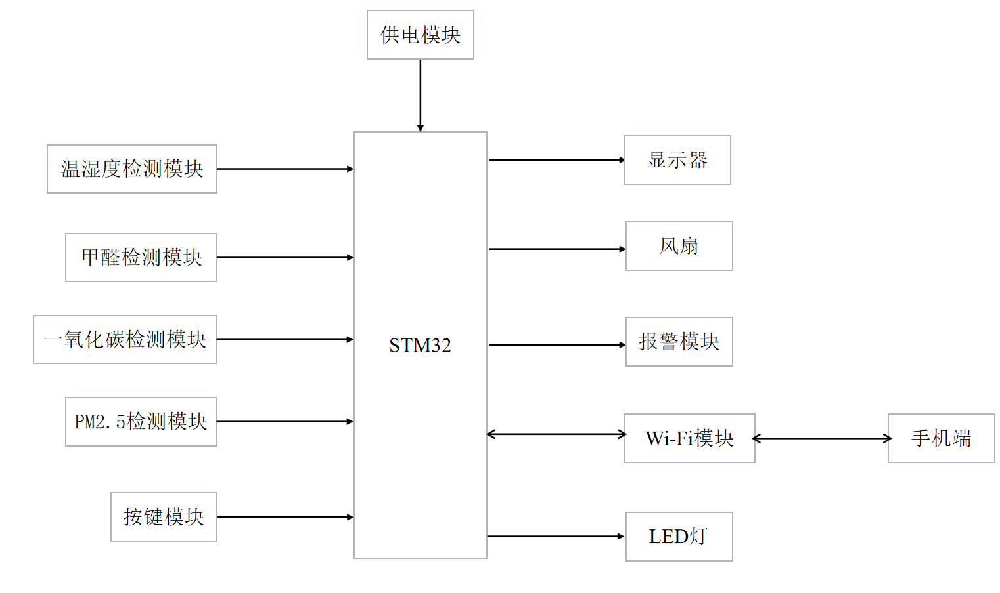
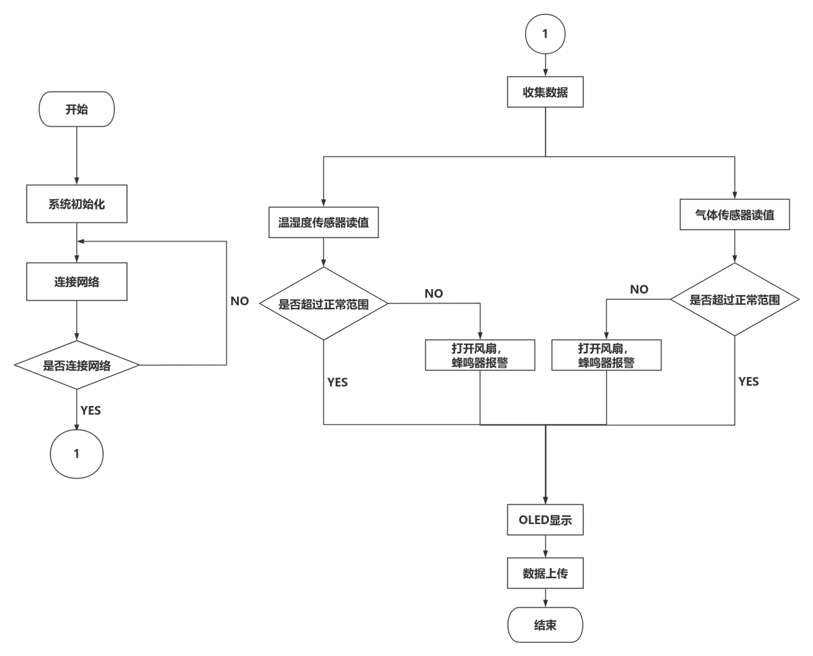
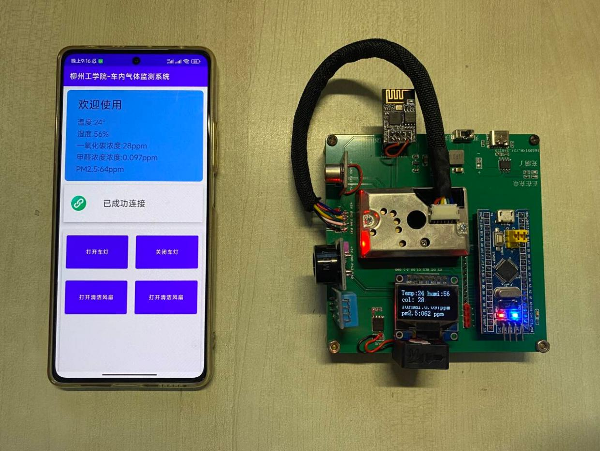
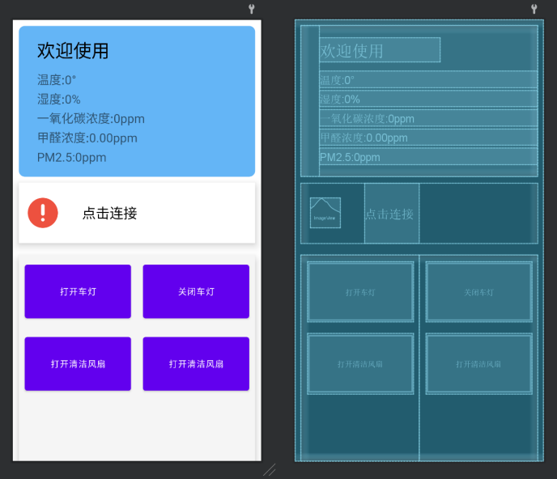
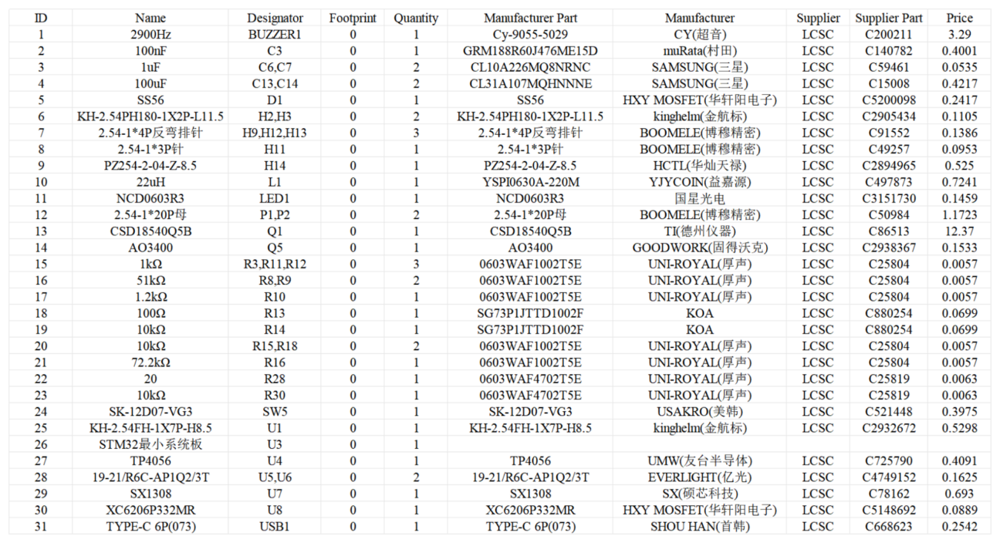

# STM32 In-Car Air Quality Monitoring System

一个基于 **STM32F103C8T6 + ESP8266** 的车内空气质量监测与远程控制系统。系统采集温湿度、CO、甲醛和 PM2.5 数据，在 OLED 上实时显示，并通过 Wi-Fi/TCP 将数据发送至移动端；当环境指标超过设定阈值时触发蜂鸣器报警，同时支持移动端控制 LED 与风扇。

> 本仓库当前主要包含 STM32 固件工程。移动端 APP 为系统配套客户端，相关界面与通信逻辑在本文档中用于说明整体方案；如后续整理 Android Studio 工程，可再单独加入 `app/` 目录。



## Features

- STM32F103C8T6 主控，72 MHz 系统时钟
- DHT11 温湿度采集
- 模拟气体传感器数据采集（CO、甲醛）
- GP2Y 系列颗粒物传感器采集 PM2.5
- OLED 本地实时显示
- ESP8266 SoftAP + TCP Server 通信
- 自定义二进制数据帧与校验和
- 环境指标越限蜂鸣器报警
- PWM 风扇控制
- 移动端远程控制 LED / 风扇

## System Architecture

系统由感知层、控制层、通信层和交互层组成：传感器负责采集环境数据，STM32 完成数据处理、阈值判断和执行器控制，ESP8266 建立 Wi-Fi/TCP 通信链路，移动端用于数据显示和远程控制。



## Hardware

| Module | Device / Function |
| --- | --- |
| MCU | STM32F103C8T6 |
| Temperature & Humidity | DHT11 |
| CO sensing | Analog gas sensor / ADC |
| Formaldehyde sensing | Analog gas sensor / ADC |
| PM2.5 | GP2Y series optical dust sensor |
| Wireless | ESP8266 |
| Display | OLED |
| Alarm | Buzzer |
| Actuator | Fan + LED |

### Main interfaces

- `USART1`: ESP8266 communication, 115200 baud
- `ADC1 / ADC2`: analog gas / particle sensing
- `TIM1 PWM`: fan speed output
- GPIO: DHT11, OLED, buzzer, ESP8266 control and LED control



## Data Processing Algorithms

### 1. ADC voltage conversion

For a 12-bit ADC with a 3.3 V reference, the sampled voltage can be represented as

$$
V_{ADC}=\frac{N_{ADC}}{4096}\times 3.3
$$

where $N_{ADC}$ is the raw ADC value in the range $0\sim4095$.

### 2. CO normalized value

The firmware maps the sampled ADC value to a normalized CO value using

$$
C_{CO}=\frac{N_{CO}}{4096}\times100
$$

where $N_{CO}$ is the corresponding ADC sample. This is the conversion currently implemented in the firmware; practical concentration measurement should be recalibrated against the specific sensor and reference instrument.

### 3. Formaldehyde conversion

The firmware first converts the ADC sample to voltage

$$
V_{HCHO}=\frac{N_{HCHO}}{4096}\times3.3
$$

and then applies a linear conversion

$$
C_{HCHO}=(-1.095+0.627V_{HCHO})\times100
$$

The coefficients are implementation parameters and should be recalibrated when the sensor, analog front-end or reference conditions change.

### 4. PM2.5 smoothing

To reduce short-term fluctuation, the PM2.5 channel uses exponential smoothing:

$$
\bar{x}_k=\bar{x}_{k-1}+\alpha(x_k-\bar{x}_{k-1})
$$

with

$$
\alpha=0.03
$$

where $x_k$ is the latest sample and $\bar{x}_k$ is the filtered value.

### 5. Threshold alarm logic

The current firmware triggers an alarm when any monitored value exceeds its configured threshold:

$$
Alarm=(T>40)\lor(H>40)\lor(C_{CO}>87)\lor(C_{HCHO}>100)\lor(C_{PM2.5}>200)
$$

When `Alarm = true`, the buzzer is activated and the fan PWM is driven to the configured alarm state. These thresholds are project configuration values rather than universal safety limits and should be adjusted or calibrated for the target application.

## Communication Protocol

ESP8266 is initialized as a Wi-Fi SoftAP and starts a TCP server. The firmware uses a compact custom frame:

```text
+--------+--------+--------+----------+----------+----------+
| 0xFD   | 0xDF   | Length | Function | Data ... | Checksum |
+--------+--------+--------+----------+----------+----------+
```

Checksum is the low 8 bits of the byte sum before the checksum field:

$$
Checksum=\left(\sum_{i=0}^{n-1}B_i\right)\bmod256
$$

### Upload frames

| Function | Payload |
| --- | --- |
| `0xF1` | Temperature + Humidity |
| `0xF2` | CO + Formaldehyde |
| `0xF3` | PM2.5 |

For `0xF1` and `0xF2`, two 8-bit values are packed into one 16-bit value:

$$
D=(D_{high}\ll8)\;|\;D_{low}
$$

### Control commands

| Command | Action |
| --- | --- |
| `0xE1` | LED ON |
| `0xE2` | LED OFF |
| `0xE3` | Fan ON |
| `0xE4` | Fan OFF |

## Mobile Client

The companion Android client connects to the ESP8266 TCP server, parses `0xF1` / `0xF2` / `0xF3` frames and displays the sensor values. It can also send `0xE1`–`0xE4` commands for LED and fan control.



## Project Structure

```text
.
├── Core/
│   ├── Inc/                 # STM32CubeMX generated headers
│   └── Src/                 # main, ADC, GPIO, UART, timer, DMA
├── Drivers/                 # STM32 HAL / CMSIS
├── MDK-ARM/
│   ├── Code/                # ESP8266, DHT11, GP2Y, OLED, buzzer drivers
│   └── liugong_wifi.uvprojx # Keil project
├── docs/images/             # README figures
├── liugong_wifi.ioc         # STM32CubeMX project
└── README.md
```

## Build & Run

1. Install STM32CubeMX and Keil MDK-ARM (or another compatible STM32 toolchain).
2. Open `liugong_wifi.ioc` to inspect peripheral configuration, or open `MDK-ARM/liugong_wifi.uvprojx` directly in Keil.
3. Check the hardware pin connections and power requirements before flashing.
4. Build the firmware and download it to STM32F103C8T6.
5. After startup, ESP8266 is configured by AT commands and starts the TCP service.
6. Connect the client to the ESP8266 network and TCP endpoint, then observe sensor data and test LED/fan control.

> Before publishing or deploying, change the Wi-Fi SSID/password hard-coded in `MDK-ARM/Code/esp8266.c`. Do not use a real personal password in a public repository.

## Demo / Test Results

The prototype has been tested for sensor acquisition, OLED display, Wi-Fi communication, TCP data exchange, threshold alarm, and remote LED/fan control.



## Notes

This repository is intended as an embedded/IoT engineering project showcase. Sensor conversion coefficients and alarm thresholds are implementation parameters and should be calibrated before use in applications that require quantitative air-quality measurements.

## License

No project-level open-source license has been selected yet. If you want others to reuse or modify the project, add an appropriate `LICENSE` file (for example MIT, Apache-2.0, or another license that matches your intended use).
